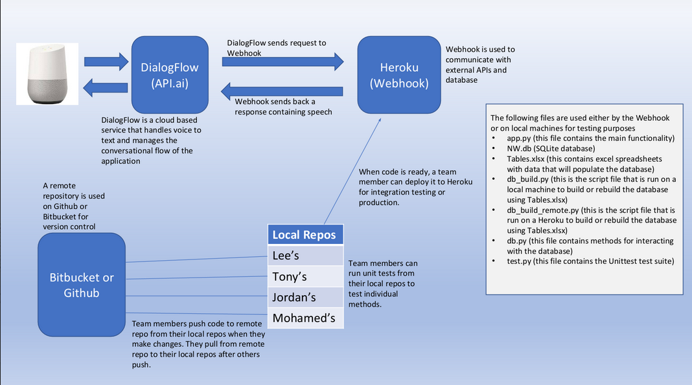
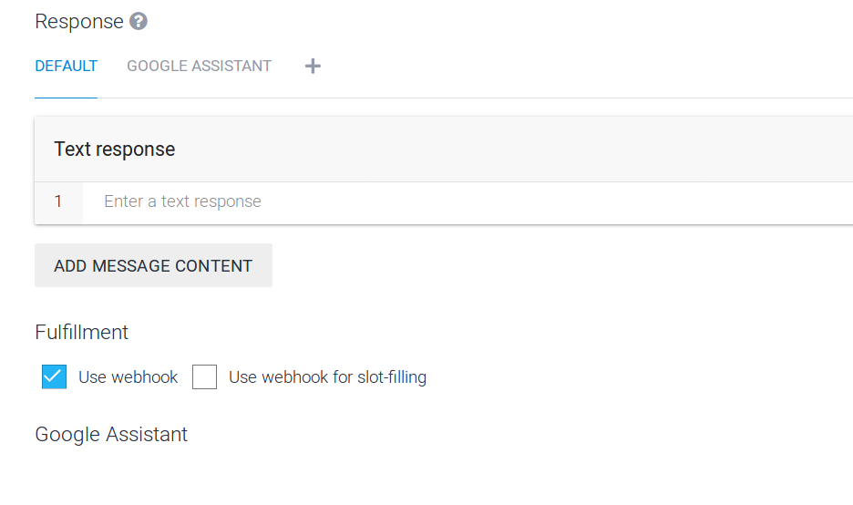
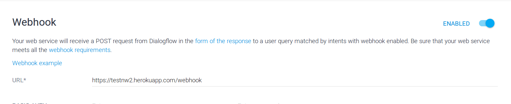
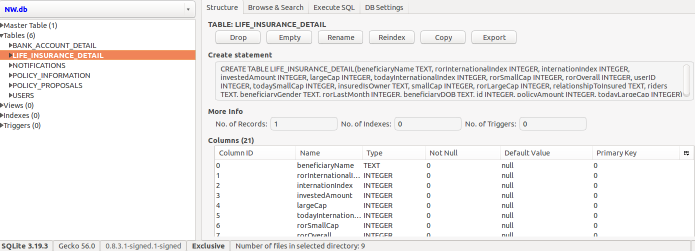
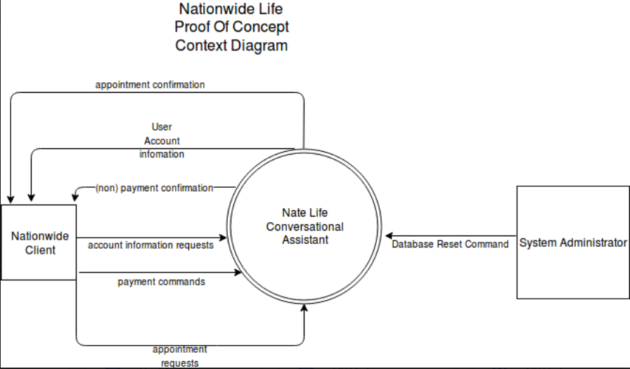
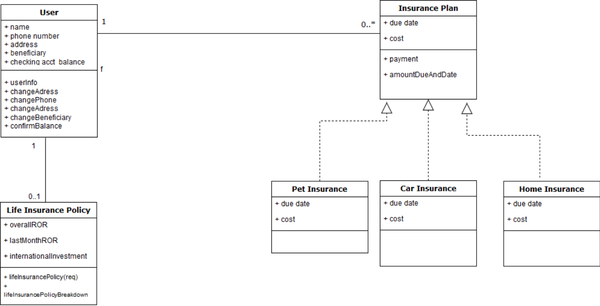

# Introduction

Welcome to the working documentation for the Nationwide Conversational Assistant "Nationwide Life". The following sections 
describe the collective functionality of the application. This includes its technology stack, architecture, methods, and datebase structure,
and any other additional notes we found important to pass on to the next team of developers. 

# Notable Project Files

## app.py
The majority of the logic (code) for the project. Methods for app.py are listed in the App.py Methods section.

## db.py
Where all database queries are run. These queries are within the functions. Each of these functions either returns some piece of data or updates the database. They are then used in app.py methods.

## db_build.py
Constructs the Sqlite3 database. Reads from the excel file <code>Tables.xlsx</code>, which consists of the db tables in excel form, to perform the build. This allows for easy editing of tables and attributes. This file is ran locally

## db_build_remote.py
Same as <code>db_build.py</code> except ran from Google Home during the reset database intent. 

## NW.DB
The raw database file. Can be viewed with Firefox sqlite plugin (available for verions 42 and above) or any other sqlite3 management application. 

## Procfile
The mechanism for declaring what commands are run by your application’s dynos on the Heroku platform.
For the purposes of this project, Heroku will only need to execute the command <code>python.app.py</code> through web. 
Read more [here](https://devcenter.heroku.com/articles/procfile)

## requirements.txt
A list of dependencies for the project. Run <code>pip install -r requirements.txt</code> to automatically install
these dependencies.

## setup.py
In the command line, in the same directory as your <code>setup</code> folder, run python setup.py to properly install xlrd, the Excel reader for database builds. 

## Tables.xlsx

The Excel file representation of the database. Xlrd reads from this file in <code>db_build.py</code> to build the database, creating <code>NW.db</code>

## Test.py
The python file where automated unit tests are ran.

# Architecture and System Components

## Architecture Logical View


## Architecture Physical View

## Process View

## General
The architecture for Google Home applications is different than conventional software solutions, but straightforward. 
Above is a sequence diagram of the process. When the user speaks a command, called an *intent*, into the device, it gets processed by a speech engine called "Dialogflow". 
<br>
<br>
Dialogflow is linked with Google Actions. (You may see this linkage by going to dialogflow.com and clicking on "Integrations"). There are a list of intents, all containing trigger phrases. A given action or response is then initiated by Dialogflow after it processes a given trigger phrase. You can add to what Dialogflow recognizes by creating a new intent, or adding a new phrase to an existing intent. 
<br>
<br>
After the intent is spoken, its associated JSON will be passed to the webhook. To ensure the webhook is being used for a given intent, check "use webhook" and save. 


The webhook handles all programming logic in the application. Within the webhook, there exists a method for nmny of the intents in Dialogflow.


## Dialogflow
You can log into Dialogflow.com with the email ipslifebc@gmail.com and the password of nationwidelife

<br>

As mentioned, Dialogflow is a speech processing engine, essentially required to develop Google Assistant apps easily. 
Components of Dialogflow we found important to this project are [intents](https://dialogflow.com/docs/intents), [entities](https://dialogflow.com/docs/entities), [actions and parameters](https://dialogflow.com/docs/actions-and-parameters), and [contexts](https://dialogflow.com/docs/contexts).


## The webhook and Heroku
Navigate to the Fulfillment tab of Dialogflow to view or edit the webhook URL.


The webhook is the center of logic for the project. We could always hardcode static responses to user commands all wthin Dialogflow. But Wwen a user speaks an intent, we want variable responses depending on who the user is. This is where the webhook comes in. 
<br>
<br>
The webhook is currently hosted on Heroku. It contains a list of functions and methods that correspond to user intents, as well as database calls to aid these functions. These can be seen in <code>app.py</code> and <code>db.py</code> respectively. <code>app.py</code> methods are described herein. 

### How Dialogflow and the Webhook communicate

## Sqlite3 and the Database

The database sits on Heroku along with the rest of the application. NW.db is the primary database file. The database is created by running <code>python db_build.py</code> in a terminal. The database can be edited by opening <code>Tables.xlsx</code> found in the project directory. This file provides an Excel representation of the database which allows for easy editing.

Databases tables include:
### BANK_ACCOUNT_DETAIL

### NOTIFICATIONS

### POLICY_INFORMATION

### POLICY_PROPOSALS

### USERS




<aside class="notice">
An simpleway to view the raw <code>NW.db</code> file is to utilize SQLite Manager for Firefox.
</aside>


# Agile Artifacts

## Context Diagram


## UML Diagram



# App.py Methods

Methods related to the app's immediate functional requirements are located in app.py. These methods are as follows:

## webhook


```python
from flask import Flask
from flask import request, redirect, session, url_for, make_response, render_template


@app.route('/webhook', methods=['POST'])
def webhook():
    req = request.get_json(silent=True, force=True)

    print(json.dumps(req, indent=4))

    res = processRequest(req)
    res = json.dumps(res, indent=4)

    r = make_response(res)
    r.headers['Content-Type'] = 'application/json'
    return r
```


This endpoint gets and parses the JSON generated from Dialogflow after an action is triggered. 


### HTTP Request

`POST http:/testnw2.herokuapp.com/webhook`

### Query Parameters

Parameter | Default | Description
--------- | ------- | -----------
include_cats | false | If set to true, the result will also include cats.
available | true | If set to false, the result will include kittens that have already been adopted.


## processRequest


This endpoint processes the JSON request that we received from Dialogflow. In that JSON request exists a specific action that corresponds to what intent was triggered in Dialogflow. We map said action to a specific function within our webhook. 

<aside class="warning">If no function exists for the given function, nothing will happen.</aside>


### Parameters

Parameter | Description
--------- | -----------
req | The request JSON received from Dialogflow to be processed


## obtainThyCredentials

```python
 event = service.events().insert(calendarId='primary', body=event).execute()
```
Grants access to the Google Calendar API by storing an access token within the project directory. If no access token is found, it will 
run an authentication flow in order to obtain said token. See [Google API Client Secrets Flow](https://developers.google.com/api-client-library/python/guide/aaa_client_secrets) for more information. For the purposes of the demo, in order to obtain the access token for a given you, run the script under "shell" to the right in a command line. A browser window will appear for you to authenticate. 


<aside class="success">
After authenticating in the browser window once, you will not need to do so again unless you wish to authenticate another user. 
</aside>


## scheduleEvent
Maps to action "Appointment" in Dialogflow. Authenticates user. Schedules event on user's Google Calendar given 
parameters  <code>date</code> and <code>time</code>. Returns a return speech back to the users.

### Parameters
Parameter | Description
--------- | -----------
req | The request JSON. We obtain parameters <code>date</code> and <code>time</code> from the request.


## userInfo


Outputs the user's information: name, address, phone number, and beneficiary. Using the request <code>req</code> JSON,
we obtain the user's ID. Then we query the database using this ID to return the user's information. 


### Parameters

Parameter | Description
--------- | -----------
req | The request JSON. We obtain parameters <code>userID</code> from the request. 


## changeAddress


Updates the user's address. Using the request <code>req</code> JSON,
we obtain the user's ID. Then we query the database using this ID to update a user's address.  


### Parameters

Parameter | Description
--------- | -----------
req | The request JSON. We obtain parameters <code>userID</code> from the request. 


## changePhone


Updates the user's phone number. Using the request <code>req</code> JSON,
we obtain the user's ID. Then we query the database using this ID to update a user's phone number.  


### Parameters

Parameter | Description
--------- | -----------
req | The request JSON. We obtain parameters <code>userID</code> from the request. 


##changeBeneficiary


Updates the user's beneficiary. Using the request <code>req</code> JSON,
we obtain the user's ID. Then we query the database using this ID to update a user's beneficiary.  


### Parameters

Parameter | Description
--------- | -----------
req | The request JSON. We obtain parameters <code>userID</code> from the request. 


 
## changeChecking


Updates the user's checking account information. Using the request <code>req</code> JSON,
we obtain the user's ID. Then we query the database using this ID to update a user's checking account information.  


### Parameters

Parameter | Description
--------- | -----------
req | The request JSON. We obtain parameters <code>userID</code> from the request. 


<aside class="notice">
The <code>change</code> methods make permanent updates to the database, until the special <code>resetDB</code> method is called (see later).
</aside>


## totalPremiumAndDueDate

Retrieve the user's total amount due across all bills, and their due dates. 
Using the request <code>req</code> JSON,
we obtain the user's ID. Then we query the database using this ID to obtain the user's premium information.


### Parameters

Parameter | Description
--------- | -----------
req | The request JSON. We obtain parameters <code>userID</code> from the request. 


## confirmBalance


```python 
def confirmBalance(req):
    parameters = req.get("result").get("parameters")
    userID = int(parameters.get("userID"))
    balance = getCheckingAccountBalance(userID)
    prems_and_dates = getAmountDueAndDuedates(userID)
    total = 0
    for i in range(0, len(prems_and_dates)):
        total += prems_and_dates[i][1]
    if balance >= total:
        speech = "Yes, your checking account balance is "+ str(balance)+ " and it is enough to pay your premium."
        speech += "would you like to go ahead with the payment?"
    else:
        speech = "No, your checking account balance is "+ str(balance)+ " and it is not enough to pay your premium."
    return {
        "speech": speech,
        "displayText": speech,
        # "data": data,
        # "contextOut": [],
        "source": "Nationwide-financial-assistant"
    }
```

Retrieve a user's balance. Used to determine if they have enough funds in account to pay off a given premium
Using the request <code>req</code> JSON,
we obtain the user's ID. Then we query the database using this ID to obtain the user's balance


### Parameters

Parameter | Description
--------- | -----------
req | The request JSON. We obtain parameters <code>userID</code> from the request. 

 


## amountAndDueDate

```python
 def amountDueAndDueDate(req):
    parameters = req.get("result").get("parameters")
    userID = int(parameters.get("userID"))
    prems_and_dates = getAmountDueAndDuedates(userID)
    count = 0
    speech1 = ""
    for i in range(0,len(prems_and_dates)):
        insurance_type = prems_and_dates[i][0]
        if prems_and_dates[i][1] > 0:
            speech1 += " Your " + insurance_type.replace("_", " ") + " payment due is " + \
            str(prems_and_dates[i][1]) + " dollars."
            date = prems_and_dates[i][2]
            count += 1
    speech = "You have " + str(count) + " payments due."
    speech += speech1
    if count >= 0:
        speech += " Your due date is " +  date + ". Do you want to check your account balance or make a payment?"
    return {
        "speech": speech,
        "displayText": speech,
        # "data": data,
        # "contextOut": [],
        "source": "Nationwide-financial-assistant"
    }
```

Retrieve a user's amount due and due date for a given insurance type or payment plan. 
Using the request <code>req</code> JSON,
we obtain the user's ID. Then we query the database using this ID to obtain the user's balance


### Parameters

Parameter | Description
--------- | -----------
req | The request JSON. We obtain parameters <code>userID</code> from the request.

<br> 


<aside class="notice">
The <code>change</code> This method differs from the <code>totalPremiumAndDueDate</code> method in that this method retrieves the amount due and due date for a specific bill, while 
<code>totalPremiumAndDueDate</code> retrieves the total amount due across all bills.
</aside>


## payment

```python
 def payment(req):
    parameters = req.get("result").get("parameters")
    userID = int(parameters.get("userID"))
    insurance_type = str(parameters.get("insurance_type"))
    change = False
    if insurance_type == "all_insurance":
        speech = "OK, I have made the "
        prems_and_dates = getAmountDueAndDuedates(userID)
        for i in range(0, len(prems_and_dates)):
            result, remain, due = payPremium(userID, prems_and_dates[i][0])
            if result:
                change = True
                if i == len(prems_and_dates) - 1 and i != 0:
                    if len(prems_and_dates) == 2:
                        speech = speech[:len(speech) - 2] + " "
                    speech += "and "
                speech += prems_and_dates[i][0].replace("_", " ") + ", "
        if change:
            speech = speech[:len(speech) - 2]
        speech += " payment for you. Your checking account has " + \
                  str(remain) + " dollars left."
    else:
        result, remain, due = payPremium(userID, insurance_type)
        if result:
            speech = "OK, I have made the " + \
                     insurance_type.replace("_", " ") + \
                     " payment for you. Your checking account has " + \
                     str(remain) + " dollars left."
        elif due != 0:
            speech = "Sorry, I can't make the payment for you because " + \
                     "you don't have enough credit in your checking account."
        else:
            speech = "You have already made the payment."
    speech += " Is there anything else I can help you with?"


    return {
        "speech": speech,
        "displayText": speech,
        # "data": data,
        # "contextOut": [],
        "source": "Nationwide-financial-assistant"
    }
```

Pays either one type of insurance plan, or all plans the user is enrolled in, provided whatever the user voices. 
If payment is successful, updates database with new values for the checking account after a given payment is made. If the user does not have the
necessary amount in their checking account, the payment will not be made, and the method will return a notice message. 
If a certain payment has already been made, the method will alert the user that they have already made that payment.


<br>

<br>

<br>

### Parameters

Parameter | Description
--------- | -----------
req | The request JSON. We obtain parameters <code>userID</code> and <code>insurance_type</code> from the request.

<br> 


## lifeInsurancePolicy

```python
def lifeInsurancePolicy(req):
    parameters = req.get("result").get("parameters")
    userID = int(parameters.get("userID"))

    overallROR = getOverallReturnRate(userID)
    lastMonthROR = getLastMonthReturnRate(userID)
    internationInvestment = getInternationInvestment(userID)
    internationalROR = getInternationalROR(userID)

    rorDifference = lastMonthROR - overallROR
   
    if rorDifference < 0:
        #speech = "Your return rate has decreased by " + str(rorDifference) + " percent over the past month relative to your overall rate of return. You have invested " + str(internationInvestment) + " dollars in international markets, this having a rate of return of " + str(internationalROR) + " percent."
        speech = "The cash value of your policy has been decreasing in value. Would you like to hear more information?"
    else:
        #speech = "Your return rate has increased by " + str(rorDifference) + " percent over the past month relative to your overall rate of return. You have invested " + str(internationInvestment) + " dollars in international markets, this having a rate of return of " + str(internationalROR) + " percent."
        speech = "The cash value of your policy has increased in value. Would you like to hear more information?"
    return {
        "speech": speech,
        "displayText": speech,
        # "data": data,
        # "contextOut": [],
        "source": "Nationwide-financial-assistant"
    }
```


Performs a basic calculation to determine if a user's policy has decreased or increased in value over time. If the rate of return for the last rolling month is less than the user's overall rate of return, we say 
that the user's rate of return has decreased. Otherwise, it has increased. 

<br>

<br>


### Parameters

Parameter | Description
--------- | -----------
req | The request JSON. We obtain parameters <code>userID</code>  from the request.


## lifeInsurancePolicyBreakdown

```python
def lifeInsurancePolicyBreakdown(req):

    parameters = req.get("result").get("parameters")
    userID = int(parameters.get("userID"))

    overallROR = getOverallReturnRate(userID)
    lastMonthROR = getLastMonthReturnRate(userID)
    internationInvestment = getInternationInvestment(userID)
    internationalROR = getInternationalROR(userID)

    rorDifference = lastMonthROR - overallROR
    
    print(rorDifference)
    if rorDifference < 0:
        speech = "Your return rate has decreased by " + str(rorDifference) + " percent over the past month relative to your overall rate of return. You have invested " + str(internationInvestment) + " dollars in international markets, the rate of return of these funds has fallen " + str(internationalROR) + " percent."

    else:
        speech = "Your return rate has increased by " + str(rorDifference) + " percent over the past month relative to your overall rate of return. You have invested " + str(internationInvestment) + " dollars in international markets, this having a rate of return of " + str(internationalROR) + " percent."

    speech = speech.replace('-', "")
    speech += " Would you like to set up an appointment with an agent?"
    return {
        "speech": speech,
        "displayText": speech,
        # "data": data,
        # "contextOut": [],
        "source": "Nationwide-financial-assistant"
    }
 ```

 idea maybe show how each method relates to speeech.


The method <code>lifeInsurancePolicy</code> will ask the user if they want to hear more information regarding life insurance. If they agree, this method is called. Uses <code>db.py</code> methods <code>getOverallReturnRate(userID)</code> <code>getLastMonthReturnRate(userID)</code> 
<code>getInternationInvestment(userID)</code> and <code>getInternationalROR(userID)</code> to retrieve the overall rate of return, last month's rate of return, international investments, and international rate of return respectively and provide this data to the user.


<br>


<br>

### Parameters

Parameter | Description
--------- | -----------
req | The request JSON. We obtain parameters <code>userID</code>  from the request.


## notifications

```python
def notifications(req):
    parameters = req.get("result").get("parameters")
    userID = int(parameters.get("userID"))

    notifications = getNotifications(userID)
    print(notifications)

    numOfNotifs = getNumberOfNotifications(userID)

    speech = "Looks like you have " + str(numOfNotifs) + " notifications. "
    
    for i in range (0, numOfNotifs):
        speech += "Number " + str(i+1) + ": "
        speech += str(notifications[i]) + " "

    deleteThese = "()\'\""
    for char in deleteThese:
        speech = speech.replace(char, "")

    speech = speech.replace(",", ".")
    speech += "would you like to review your payment due?"
    #print(speech)
    return {
        "speech": speech,
        "displayText": speech,
        # "data": data,
        # "contextOut": [],
        "source": "Nationwide-financial-assistant"
    }
```

Retrives user notifications from the database. 


### Parameters

Parameter | Description
--------- | -----------
req | The request JSON. We obtain parameters <code>userID</code>  from the request.


## verifyPinFufillRequest

```python
def verifyPinFufillRequest(req):
    parameters = req.get("result").get("parameters")

    userID = int(parameters.get("userID"))
    pin = (parameters.get("mypin"))
    pin = str(pin)

    #hash the pin
    pin.encode('utf-8')
    encryptedPin = hashlib.sha512(pin.encode('utf-8')).hexdigest()
    encryptedPin = str(encryptedPin)

    #compare hashed pin to pin from database (use query)
    databasePin = getHashedUserPin(userID)
    databasePin = str(databasePin)

    if databasePin == encryptedPin:
        #print("TRUE")

        speech = "Okay. Acquiring your secrets. One moment"

    else:
        speech = "Incorrect Pin. Returning to main menu."
    return{
        "speech": speech,
        "displayText": speech,
        "source": "Nationwide-financial-assistant"
    }
```

<aside class="warning">Method not used in current version.</aside>

As a concept, if the user is going to access something otherwise confidential, they would speak or type a pin into their assistant.
We get the pin number the user gave the assistant through the <code>mypin</code> parameter in the JSON. We hash this pin 
using the same hash used for the database pin, and compare the incoming pin versus the db pin. If they are equal, we carry out user's request. 


<br>


### Parameters

Parameter | Description
--------- | -----------
req | The request JSON. We obtain parameters <code>userID</code> and <code>mypin</code> from the request.


## dbReset

```python
def dbReset(req):
    os.system('python db_build_remote.py')
    speech = "The database has been reset!"
    return {
        "speech": speech,
        "displayText": speech,
        # "data": data,
        # "contextOut": [],
        "source": "Nationwide-financial-assistant"
    }
```

This is a special function created for demo purposes to reset database. 

<aside class="warning">This function is not meant to satisfy any particular use case regarding the project. This is only for demo purposes; to yield the same experience each round of the demo. </aside>


## initialize 

```python 
def initialize(req):
    os.system('python db_build_remote.py')
    speech = "Hello! I have some important updates regarding your Nationwide accounts. Would you like to hear it?"
    return {
        "speech": speech,
        "displayText": speech,
        # "data": data,
        # "contextOut": [],
        "source": "Nationwide-financial-assistant"
    }    
```

(Re)Initializes the database and assistant after the reset.
